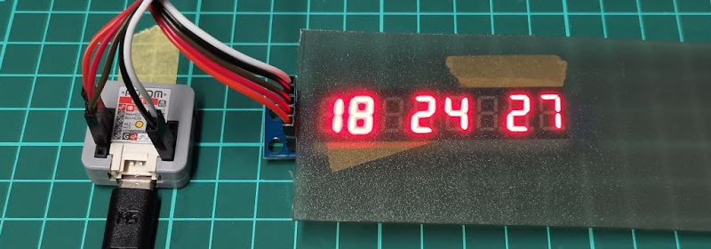
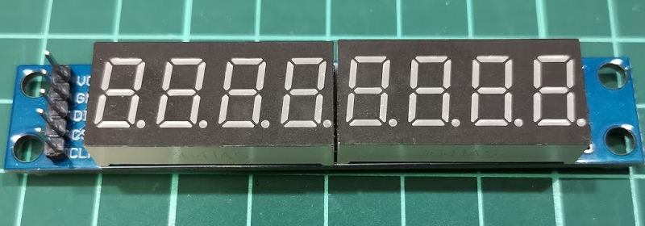
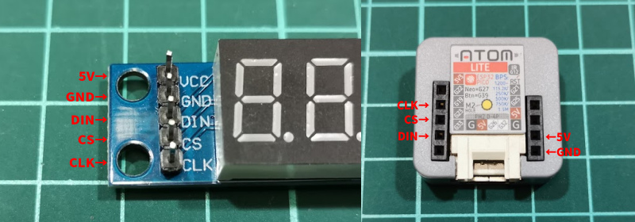

# M5Atom MAX7219 7segLED clock

M5Atom LiteとMAX7219を用いた4連Matrix LEDモジュールを使用した、NTPから時刻を取得する時計。

## Parts

- M5Atom Lite
  - https://docs.m5stack.com/en/core/atom_lite
  - https://www.switch-science.com/catalog/6262/
- MAX7219 7seg LED (8-digits)
  - 
  - https://www.amazon.co.jp/dp/B01D0WSCJA/
  - 類似品は他の販売者からも入手可能 (MAX7219を搭載していることを確認)
- Jumper Wire
  - https://www.switch-science.com/catalog/2294/
  - なんでもかまわない

## Pin assign

|M5Atom|MatrixLED|
|---|---|
|G22|CLK|
|G19|CS|
|G23|DIN|
|5V|VCC|
|GND|GND|

## Compile

Arduino IDEでM5Atomにプログラムが書き込める環境を用意します。
https://docs.m5stack.com/en/arduino/arduino_development

Cloneしたコードに含まれている`net-inst.h`を`net.h`としてコピーし、Wi-FiのSSIDとパスワードを書き換えてください。

## Reference

- Wi-Fi and NTP
  - https://github.com/espressif/arduino-esp32/blob/master/libraries/ESP32/examples/Time/SimpleTime/SimpleTime.ino
- MAX7219 (LedControl)
  - http://wayoda.github.io/LedControl/

